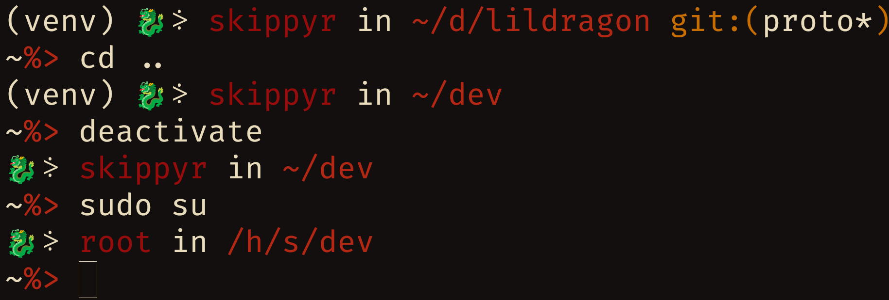

# Lildragon
## About
A simple theme for the ZSH shell with a dragon and Git support.


It can show you:
-   Your user name.
-   If inside a Git repository, the branch.
-   Your current directory.

## Installation
### Dependencies
The following dependencies must be installed to install this software properly:
-   `git`
-   An emojis font.

### Procedures
-   Clone this repository.
```bash
git\
    clone --depth=1 https://github.com/skippyr/lildragon\
    ~/.local/share/zsh/themes/lildragon
```

-   Add the following source rule to your `~/.zshrc` file. Ensure to not source other theme.
```bash
source ~/.local/share/zsh/themes/lildragon/lildragon.zsh-theme
```

-   Reopen ZSH.

## Copyright
This software is under the MIT license. A copy of the license is bundled with the source code.
